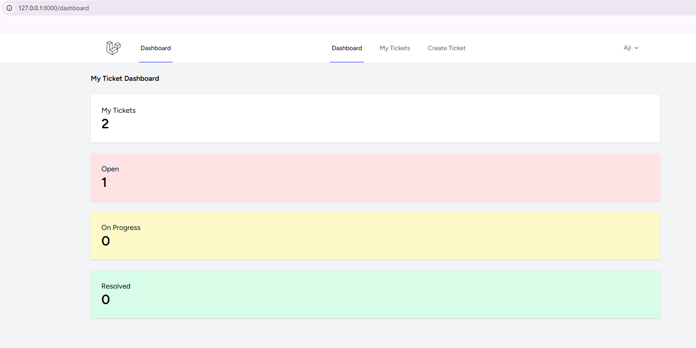
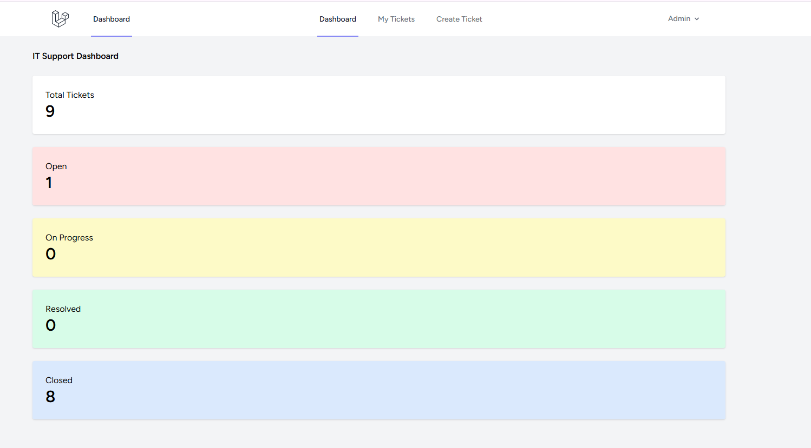
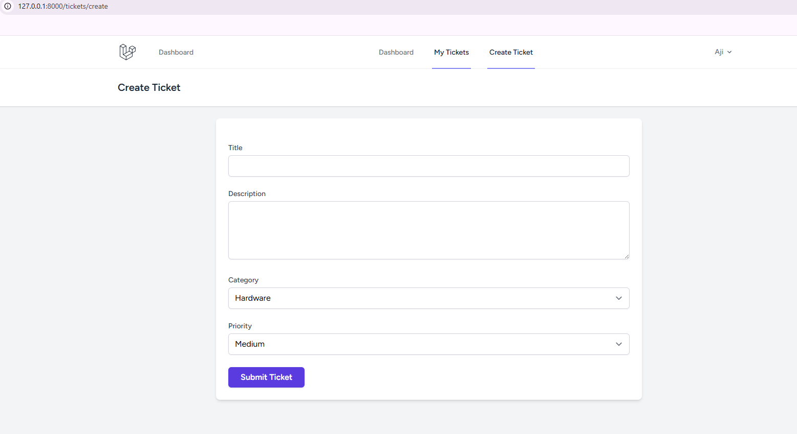
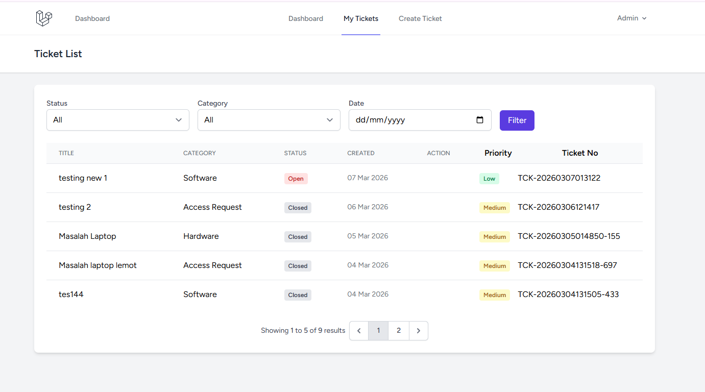
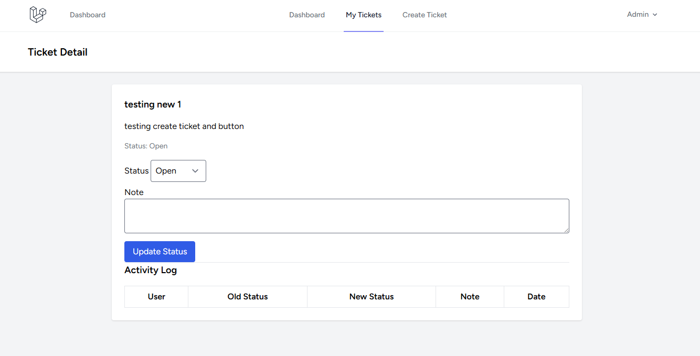
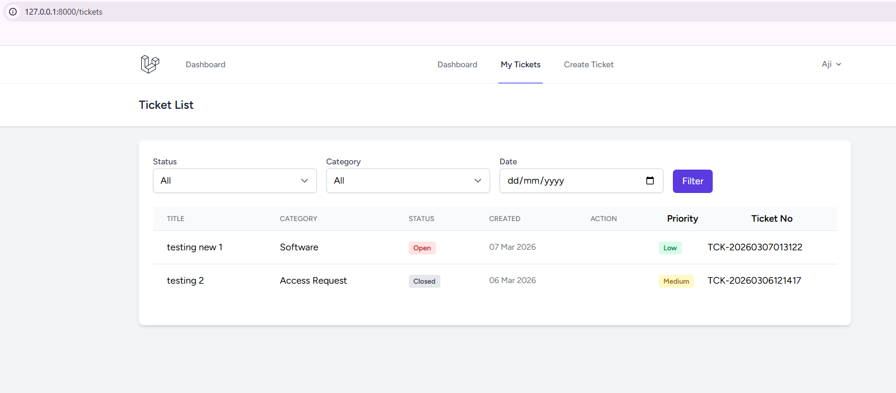
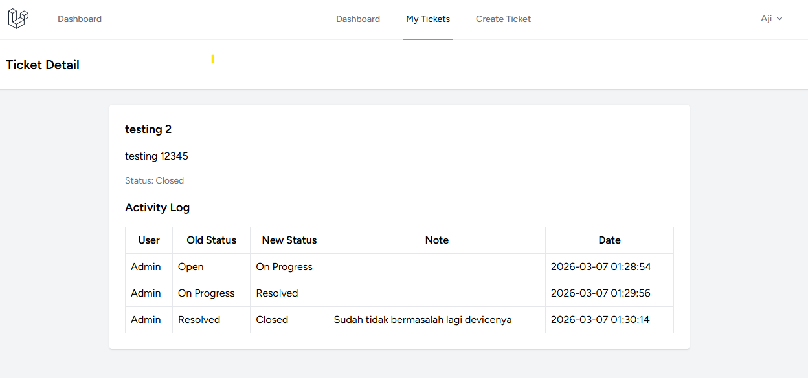

Helpdesk Ticketing System

Technical Test – IT Developer

Aplikasi Helpdesk Ticketing System berbasis Laravel yang digunakan untuk membantu proses pelaporan dan penanganan masalah IT di dalam perusahaan.

User dapat membuat tiket laporan masalah, sementara IT Support dapat mengelola status tiket serta memonitor aktivitas tiket melalui dashboard.

Tech Stack

PHP 8.2

Laravel 12

MySQL

Blade Template

Bootstrap

Fitur Aplikasi
Manajemen Tiket

Membuat tiket laporan masalah

Kategori tiket

Prioritas tiket (Low / Medium / High)

Nomor tiket otomatis

Alur Status Tiket

Status tiket mengikuti alur berikut:

Open → On Progress → Resolved → Closed

Status hanya dapat diubah oleh IT Support

Validasi perubahan status

Activity Log

Menyimpan riwayat perubahan status tiket

Catatan tambahan dari IT Support

Dashboard
Dashboard IT Support

Menampilkan statistik tiket seperti:

Total tiket

Tiket Open

Tiket On Progress

Tiket Resolved

Tiket Closed

Dashboard User

Menampilkan:

Jumlah tiket yang dibuat user

Status tiket user

Filter Tiket

Tiket dapat difilter berdasarkan:

Status tiket

Kategori tiket

Tanggal pembuatan tiket

Cara Menjalankan Project
1. Clone Repository
git clone https://github.com/Chrisjohanes/helpdesk-ticketing-system.git
cd helpdesk-ticketing-system
2. Install Dependency
composer install
npm install
3. Copy File Environment
cp .env.example .env
4. Generate Application Key
php artisan key:generate
5. Konfigurasi Database

Edit file .env

DB_DATABASE=helpdesk
DB_USERNAME=root
DB_PASSWORD=
6. Jalankan Migration dan Seeder
php artisan migrate --seed
7. Menjalankan Server
php artisan serve

Buka di browser:

http://127.0.0.1:8000

## Screenshot Aplikasi

### Dashboard

### Create Ticket

### Detail Ticket

Pengembangan Selanjutnya

Beberapa fitur yang dapat ditambahkan:

Assign IT Support ke tiket

Notifikasi email ketika tiket dibuat atau diperbarui

SLA monitoring tiket

Grafik statistik tiket pada dashboard

Author

Chris Johanes
