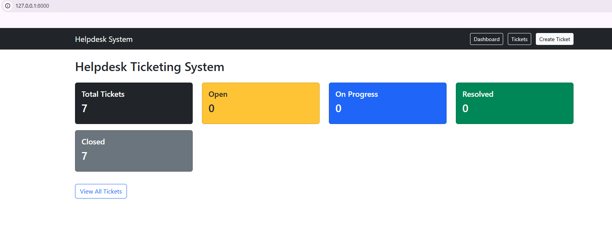
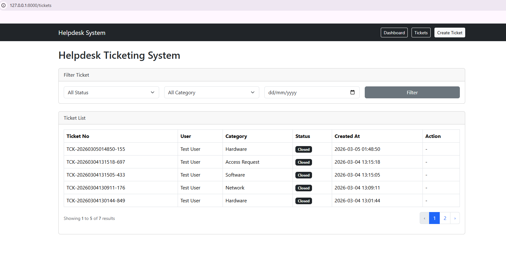
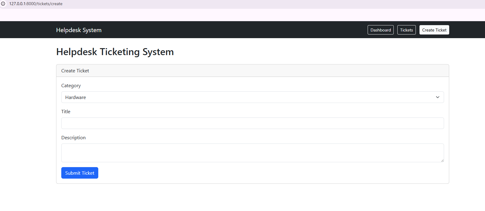

# Helpdesk Ticketing System

Technical Test - IT Developer

## Tech Stack
- Laravel
- MySQL
- Blade
- Bootstrap

## Features
- Create ticket
- Ticket status workflow
- Ticket logs
- Dashboard
- Ticket filtering

## Setup

Clone repository

git clone https://github.com/Chrisjohanes/helpdesk-ticketing-system.git

Install dependency

composer install

Copy env

cp .env.example .env

Generate key

php artisan key:generate

Run migration

php artisan migrate --seed

Start server

php artisan serve

## Screenshots

### Dashboard

### Ticket List

### Create Ticket

